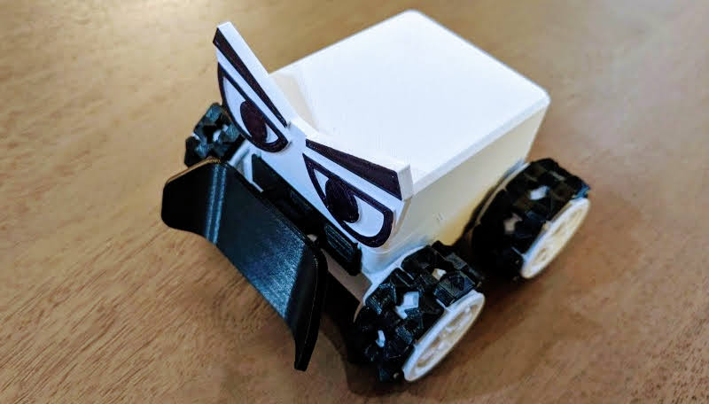
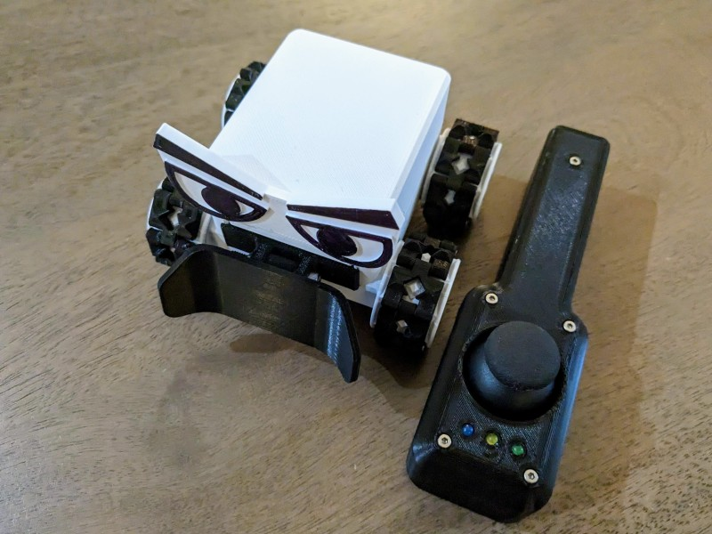
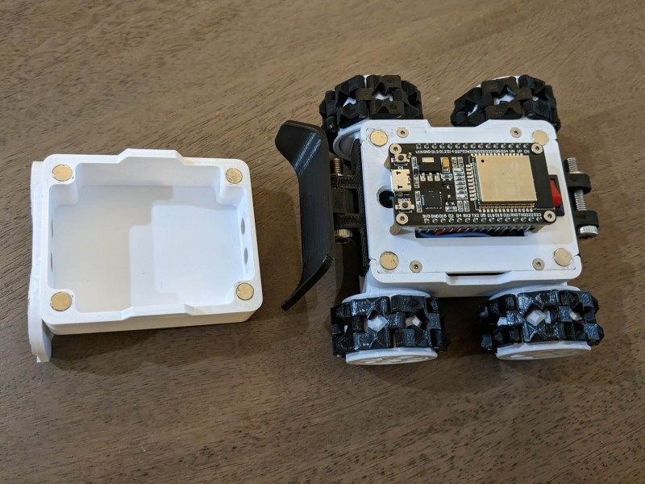

#  Smarty

A mini robot modified based on [SMARS modular robot](https://www.thingiverse.com/thing:2662828)

## Objective

The objective of this work is to build a cute little robot for my daughter. It could be a toy for her to play with, but my main intention is to let her have an early access to engineering knowledge and inspire her for future learning.

## Overview

The brain of Smarty is a ESP32 Dev board powered by a 9V battery. It is programmed with Arduino.

