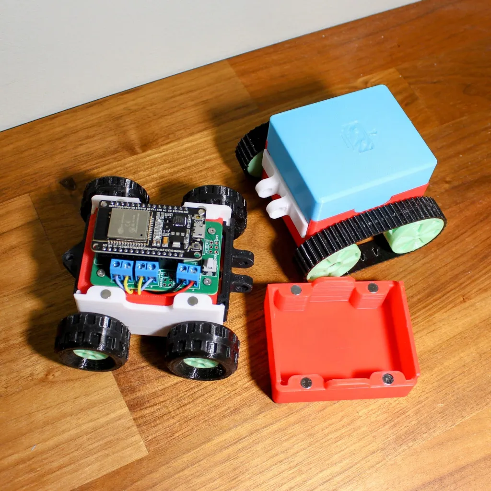
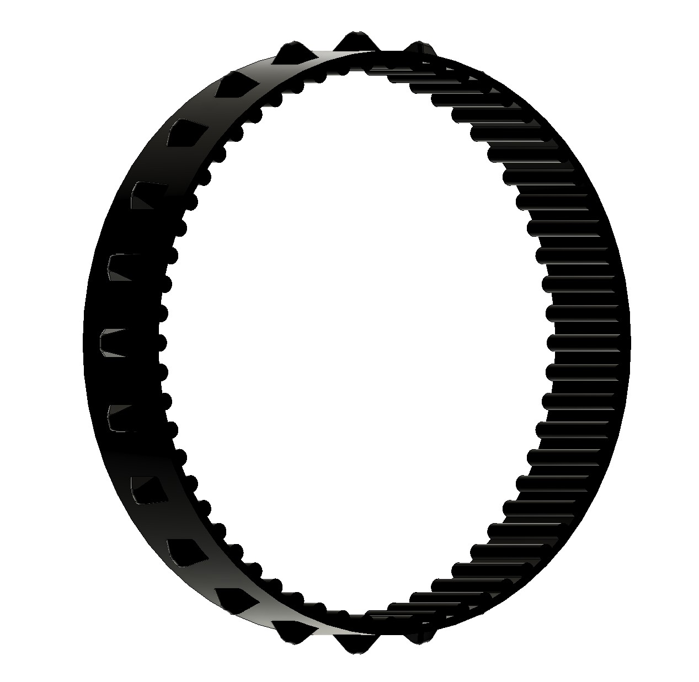

#  Smarty

## Overview

This compact, remote-controllable robot car features a lightweight 3D-printed chassis, making it both durable and customizable. Powered by a 9V battery and driven by an ESP32 development board, the car supports wireless control via Wi-Fi. Perfect for hobbyists and educational projects, it combines mobility, smart control, and DIY engineering in one sleek package.

## Mechanism

### 3D-Printed Parts

| Filename          | Thumbnail                                                                     | Required # | Note                                                     |
| ----------------- | ----------------------------------------------------------------------------- | ---------- | -------------------------------------------------------- |
| chassis           |                      | 1          | 8 x [6mm (diameter) x 2mm (thickness)] magnets           |
| motor_cover       |              | 2          |                                                          |
| pcb_holder        |                | 1          |                                                          |
| top_cover         |                  | 1          | 4 x [6mm (diameter) x 2mm (thickness)] magnets           |
| battery_cover     |          | 1          | 4 x [6mm (diameter) x 2mm (thickness)] magnets           |
| fill_block        |                | 0 or 2     | Same numbers as slave wheels                             |
| wheel_master      |            | 4 or 2     | 4-wheel drive or 2-wheel drive                           |
| wheel_slave       |              | 0 or 2     | 4-wheel drive or 2-wheel drive                           |
| tire              |                            | 4          | Print with TPU, compatible with Lego 56891 Tire 37 x 18R |
| wheel_master_belt |  | 2          |                                                          |
| wheel_slave_belt  |    | 2          |                                                          |
| belt              |                            | 2          | Print with TPU                                           |
| connector_front   |      | 1          |                                                          |
| connector_trailer |  | 1          |                                                          |

## Software

### ESP32

- Install `esp32` in Arduino IDE's Boards Manager.
- Select `ESP32 Dev Module` for the board.
