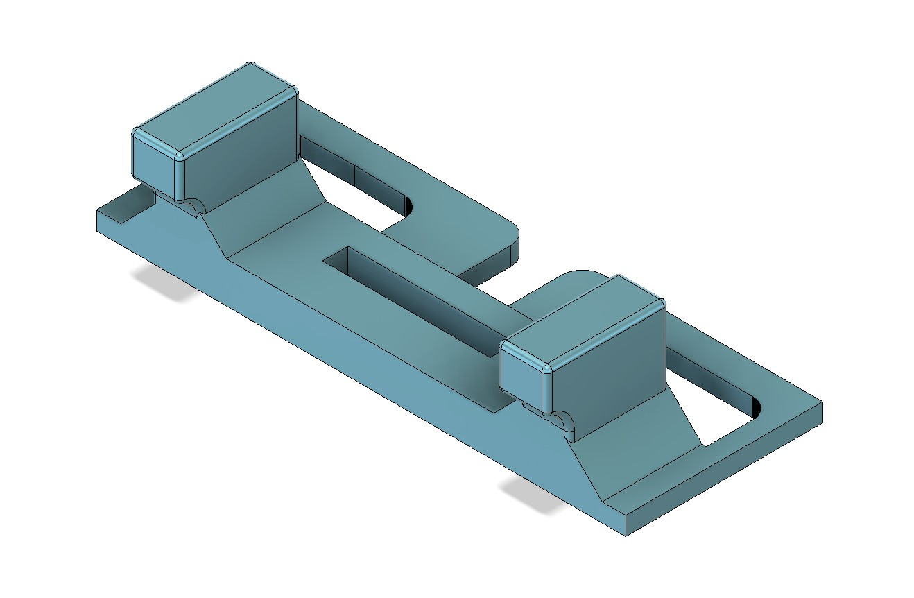
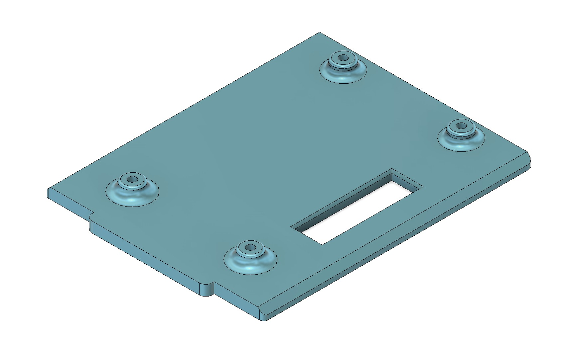

#  Smarty

## Objective

The objective of this work is to build a cute little robot for my daughter. It could be a toy for her to play with, but my main intention is to let her have an early access to engineering knowledge and inspire her for future learning.

## Overview

This compact, remote-controllable robot car features a lightweight 3D-printed chassis, making it both durable and customizable. Powered by a 9V battery and driven by an ESP32 development board, the car supports wireless control via Wi-Fi. Perfect for hobbyists and educational projects, it combines mobility, smart control, and DIY engineering in one sleek package.

## Mechanism

### 3D-Printed Parts

| Filename           | Thumbnail                                                                     | Required # |
| ------------------ | ----------------------------------------------------------------------------- | ---------- |
| chassis            |                      | 1          |
| motor_cover        |              | 2          |
| pcb_holder         |                | 1          |
| top_cover          |                  | 1          |
| battery_cover      |          | 1          |
| fill_block         |                |            |
| master_wheel_oring |      |            |
| slave_wheel_oring  |        |            |
| connector_front    |      | 1          |
| connector_trailer  |  | 1          |

## Software

### ESP32

- Install `esp32` in Arduino IDE's Boards Manager.
- Select `ESP32 Dev Module` for the board.

`smarty.ino` is for the robot, and `joystick.ino` is for the remote controller.
